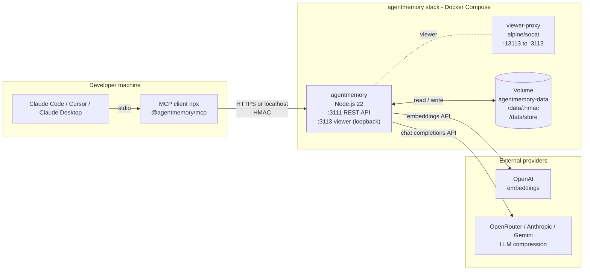

# Architecture

System layout, component responsibilities, and data flow for the
agentmemory self-host stack.

## Overview

## Components

### `agentmemory` (container)

Node.js 22 process running `@agentmemory/agentmemory`. Responsible for:

- REST API on `:3111` (memory CRUD, search, consolidation)
- Viewer UI on `:3113` (loopback only inside container)
- HMAC secret generation on first boot, stored at `/data/.hmac` (mode 0600)
- Persistent state under `/data/store`

Runtime entrypoint chain: `tini -> entrypoint.sh -> gosu agentmemory -> node`.

### `viewer-proxy` (container)

`alpine/socat` sidecar. Required because the viewer binds to `127.0.0.1`
inside the `agentmemory` container and is not exposed by default. socat
forwards traffic from `0.0.0.0:13113` to `127.0.0.1:3113`, which the host
publishes on `127.0.0.1:3113`.

Uses `network_mode: service:agentmemory` so both containers share the
same network namespace.

### Volume `agentmemory-data`

Named Docker volume mounted at `/data` inside the `agentmemory` container.
Contents:

- `/data/.hmac`: HMAC secret, generated once on first boot
- `/data/store/`: memory store data files

Volume persistence is required for memory continuity. Deleting the volume
regenerates the HMAC secret and erases all stored memory.

## Network model

| Surface | Address | Exposure |
|---------|---------|----------|
| REST API | `127.0.0.1:3111` | Host loopback (default) |
| Viewer | `127.0.0.1:3113` (via socat) | Host loopback (default) |
| Internal viewer | `127.0.0.1:3113` inside container | Container loopback only |

For VPS deployment, the host loopback is replaced with `0.0.0.0` binding
plus an HTTPS reverse proxy (Nginx or Nginx Proxy Manager) and a firewall
rule restricting source IPs.

## Authentication

Clients authenticate using a 64-character HMAC secret passed as the
`AGENTMEMORY_SECRET` environment variable to the MCP client process.

- The secret is generated on first container boot and stored at `/data/.hmac`
- `make secret` reads the value from the running container
- Rotating the secret requires deleting `/data/.hmac` and restarting

## External integrations

The stack depends on two independent providers configured via
`docker/.env.server`:

| Role | Provider | Required env var |
|------|----------|-----------------|
| Embeddings (vector search) | OpenAI | `OPENAI_API_KEY` |
| LLM compression | OpenRouter / Anthropic / Gemini | `OPENROUTER_API_KEY` or `ANTHROPIC_API_KEY` or `GEMINI_API_KEY` |

Both providers are accessed outbound over HTTPS; no inbound provider
traffic is required.

## Healthcheck

Both containers declare healthchecks:

- `agentmemory`: `curl /agentmemory/livez` every 30 s, start period 30 s,
  3 retries
- `viewer-proxy`: `socat /dev/null TCP:127.0.0.1:13113` every 30 s

The `viewer-proxy` `depends_on.agentmemory.condition` is set to
`service_healthy`, so it starts only after `agentmemory` reports healthy.

## Logs

Container logs go through the Docker JSON file driver with rotation
(`max-size: 10m`, `max-file: 3`). The `scripts/up.sh` log watcher
tails `docker compose logs` and writes to `logs/agentmemory-YYYY-MM-DD.log`
on the host, with daily rotation and 14-day retention.
